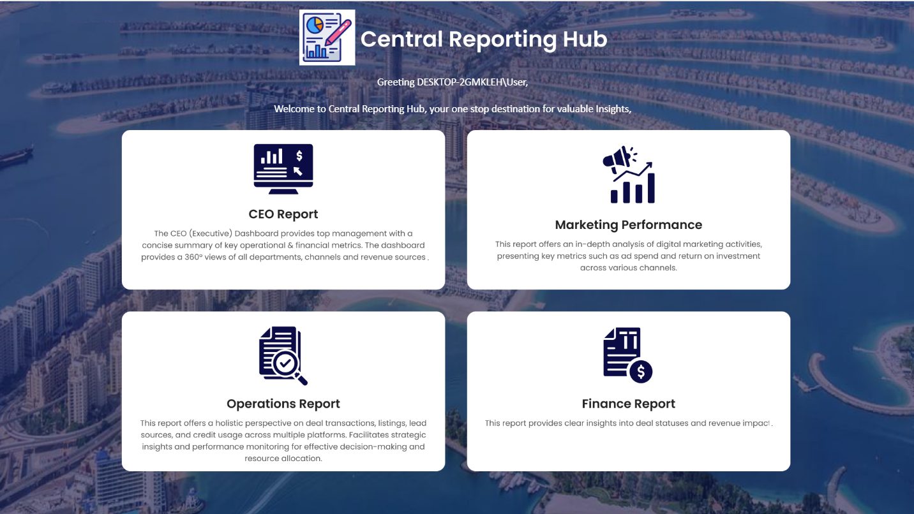
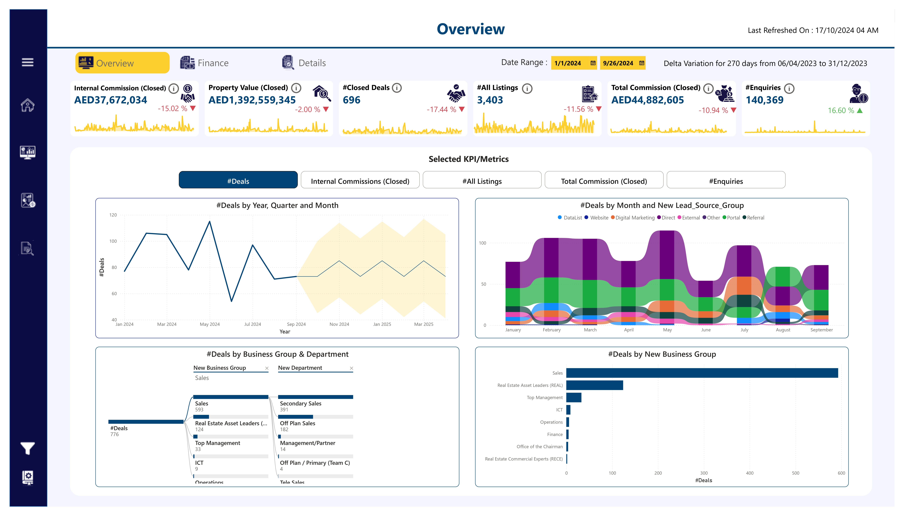
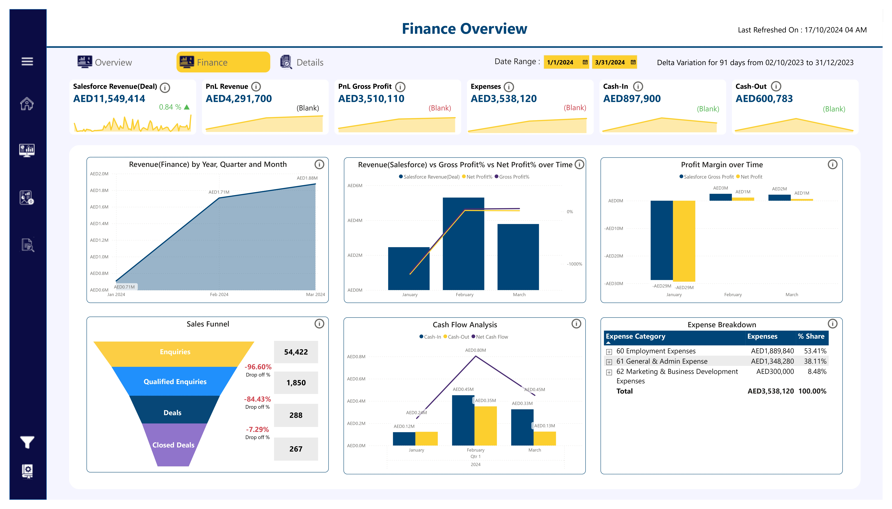
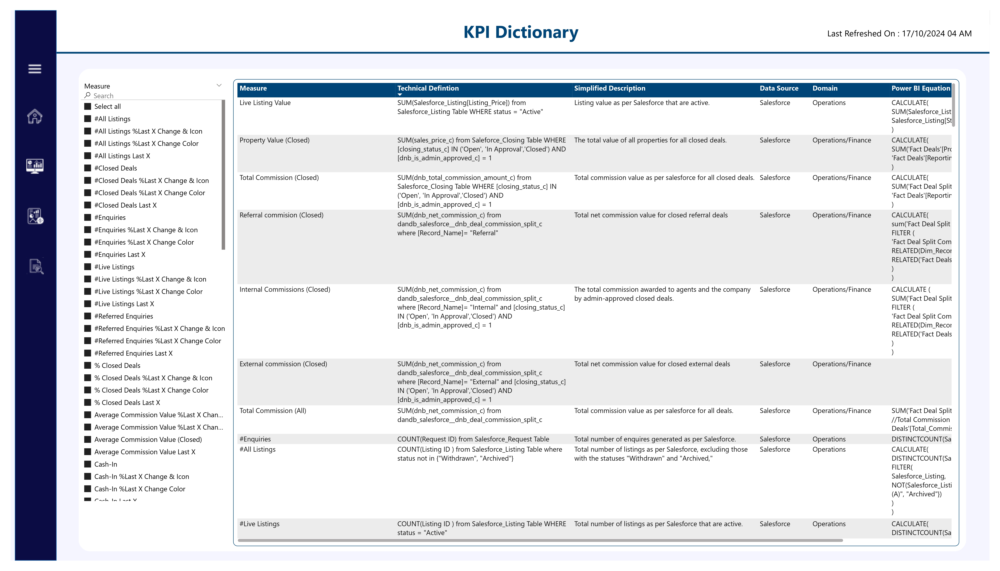

# 🏡 Real Estate Analytics – Power BI Dashboard Project

This Power BI reporting system offers a streamlined experience for exploring real estate business insights across finance, operations, marketing, and executive summaries. Each page is designed to serve a unique purpose while keeping usability and performance top of mind.

---

## 📌 **1. Landing Page – Navigation Hub**

The **landing page** acts as a centralized navigation panel, built using **button-linked visuals**. This acts as a launchpad for various functional reports tailored to stakeholder needs.

### *Benefits*:
- Easy-to-use interface  
- Quick access to functional reports  
- Time-saving through reduced navigation guesswork  

---

## 📊 **2. Executive Overview – Performance Summary**

This dashboard presents a **high-level snapshot** of KPIs to help business leaders track:

- Internal commissions  
- Property values  
- Closed deals  
- Lead enquiries  

Users can filter data across **time, business units, departments, and lead sources**, with dynamic visuals enabling fast trend analysis.

---

## 💰 **3. Finance Dashboard – Revenue & Profitability Insights**

Designed for finance teams, this report provides visibility into:

- Salesforce Revenue  
- Profit Margins (Gross & Net)  
- Expense Breakdown  
- Cash Flow Movements  
- Lead Conversion Funnel

Visual tools such as **trend charts** and **sales funnels** offer deep insight into revenue generation and cost management.

---

## 🏢 **4. Business Performance Summary**

This report focuses on key **business metrics**, including:

- Revenue generated  
- Lead analysis  
- Property performance

It allows stakeholders to quickly identify high-performing areas and track deal progression across time.

---

## 📘 **5. KPI Dictionary – Definitions & Usage Guide**

The **KPI Dictionary** ensures data literacy and consistency across teams by offering:

- Clear KPI definitions  
- Business meanings  
- Metric calculation methods  
- Department & category tagging  

